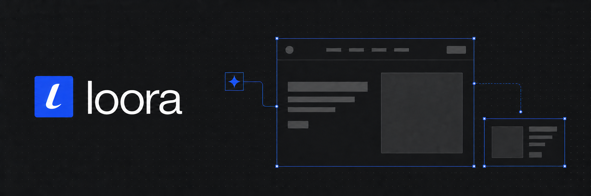

# Loora

A local-first canvas design tool your agent can edit. Arrange structured UI
nodes on the canvas; connect Claude, Codex, Cursor, or opencode over MCP and
it works on the same document. Branches, version history, and one-way export
to HTML, React/TSX, JSON, and PNG.

No accounts, no servers to operate: the desktop app keeps one SQLite file and
starts its own local API + MCP server on loopback.

Bun · Tauri · Drizzle + SQLite · oRPC.

## Design guide skill

Teaches an agent how to use the canvas tools well. Add `-g` to install it for every project.

```bash
npx skills add https://github.com/lassejlv/loora/tree/main/skills/loora-design-guide
```

## Monorepo layout

- `apps/desktop` — the Tauri desktop app: loopback host, Vite interface, spawns the local server sidecar
- `apps/mcp` — the local server: MCP endpoint, oRPC API, assets, handoffs, live event stream, all on SQLite
- `packages/canvas` — document model, engine, merge, renderer, import, export
- `packages/editor` — the editor shell, panels, and client sync
- `packages/shell` — design browser, settings, integrations, mounted by the desktop app
- `packages/platform` — which client this is, and where its API and links point
- `packages/ui` — shared design-system primitives and design tokens
- `packages/agent` — the shared canvas tool vocabulary for MCP and handoff
- `packages/rpc` — the oRPC router, storage, handoff tokens, version history
- `packages/db` — Drizzle schema, bun:sqlite client, migrations
- `packages/realtime` — wire protocol plus the in-process local event bus

## Run it

```bash
bun install
bun run dev              # local server on :4100
bun run dev:desktop      # the native window (needs Rust + Tauri prereqs)
```

Point an MCP client at `http://127.0.0.1:4100/mcp` — the app's Integrations
page shows the exact snippets. `bun run build:desktop` produces the packaged
app with the server compiled in.

## License

Copyright (C) 2026 Lasse Vestergaard

Loora is free software: you can redistribute it and/or modify it under the
terms of the **GNU Affero General Public License** as published by the Free
Software Foundation, either version 3 of the License, or (at your option) any
later version.

See [LICENSE](./LICENSE) for the full license text.

You may fork, modify, and self-host Loora (including for business use). If you
modify the software and provide it to users over a network, AGPL-3.0 requires
you to offer the corresponding source to those users under the same license.
